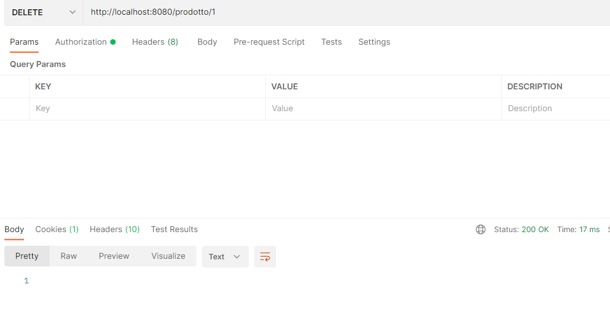
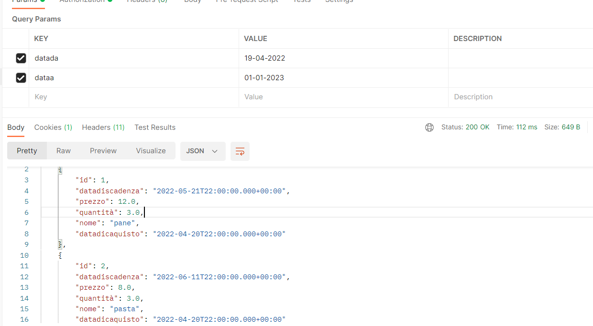

# TestProdotto
Test finale

### link repository
[il mio repository]( https://github.com/Desire1912/TestProdotto.git)

### Esempio di query

1. Esempio di query per visualizzare i prodotti con metodo get
   

2. Esempio di query per trovare attraverso l'id un prodotto con metodo get
   

3. Esempio di query per inserire un nuovo prodotto con metodo post

4. Esempio di query per aggiornare prodotto con metodo put 

5. Esempio di query  con metodo delete

6. Esempio di query per la ricerca delle date di acquisto  con metodo get

7. Esempio di query  con metodo upload

